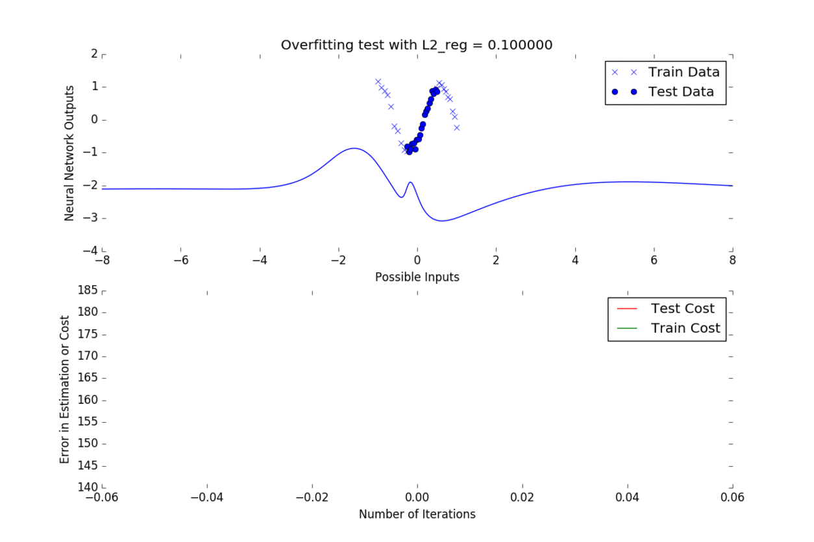

# Neural Networks: As concise as they get

Machine Learning, being the fascinating field it is, might at times seem un-intuitive and at times even convoluted in its implementation. The aim of this repository is to provide concise neural network implementations and tutorials along with them, in order to facilitate their introduction.

# What is a neural network?

A neural network is a computer learning system modelled after the human brain's method of learning. While we will not go into details of its biological coherence, it is heavily inspired on the brain's transfer of signals between neurons in the process of human learning.

Roughly, a neural network look as so:

http://cs231n.github.io/neural-networks-1/

It consists of an input layer, hidden layers, and an output layer. It's major use is to "train" inputs into outputs. More information on basic neural networks can be found here: http://cs231n.github.io/neural-networks-1/

[Neural Network in less than 20 lines of python](/tutorials/neural_network_under_20_lines.md)

[Regularization Example](tutorials/regularization_example.md)

[Simple neural network for binary classification example](tutorials/simple_neural_network_example.md)

# Dependencies

The implementations depend on autograd (https://github.com/HIPS/autograd), a numpy code differentiator, for the objective function derivatives and optimizers. 

# Future Work

Current work is being done into developing concise implementations of Bayesian Neural Networks with reguralization, and Readme and tutorials with explanations of implementations are in the process of being written. 
