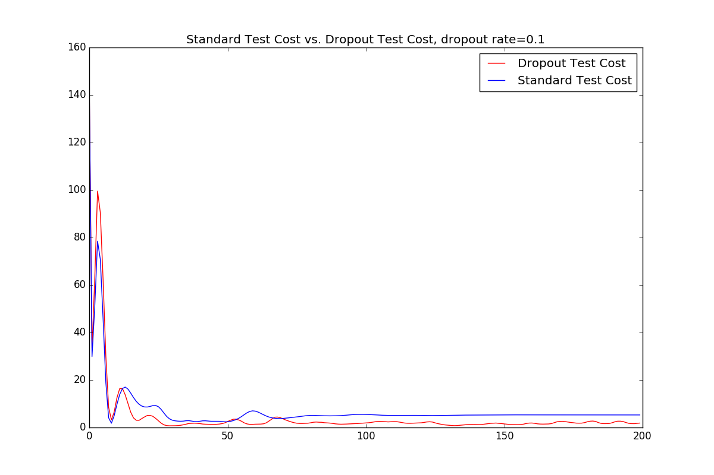

# Neural Network Dropout Example

[Full code here](../final_code/concise_dropout.py).

In this example, we analyze the dropout technique, where random nodes from our neural network are switched off during training to maximize test performance. More theory behind it can be found here: <https://www.cs.toronto.edu/~hinton/absps/JMLRdropout.pdf>. 

The technique is used to increase test set accuracy on neural networks and reduce overfitting. The intuition behind the technique is the following: if nodes are always used together, they could become dependent on each other in ways specific to the training case. If random nodes are deleted during training, then every node will be trained to produce useful values regardless of its surrounding nodes. This will ensure that, when test sets are used that stimulate different combinations of nodes, these nodes will be prepared to deal with this "foreign" environment. 

This is done by adding the following lines to the previous concise neural network code:

```python
    if dropout_train: inputs *= np.random.binomial([np.ones_like(inputs)],(1-dropout_rate))[0]
    else: inputs *= (1-dropout_rate)
```
Where dropout_rate is the percentage of nodes we would like to drop out from each layer at once.

The first line sets randomly selected nodes based off of the binomial distribution to zero. This is the line that deletes the random nodes if dropout_train is set. 

The second line is used during testing, where the input node must be multiplied by (1-dropout_rate). This is due to the fact that the nodes have been trained with a statistical (1-dropout_rate)% of their total size, so it would only be fair to scale them up back to the size of the full network during testing.

And that is it, below is a visualization of the dropout network with a dropout_rate of 0.1:

 

Dropout rates can be determined experimentally or through hyperparameter optimization, and they depend on the size of your network.

Now, let us analyze how effective dropout is at reducing overfitting:



In the above image, the dropout test cost is visibly lower than a standard test cost run on the same neural network.

A visual display version of the code is available [here](../final_code/dropout_visualized.py) which demonstrates dropout's test performance. It is important to note that the concise_dropout.py code does not demonstrate test performance, but simply outputs the training error.


