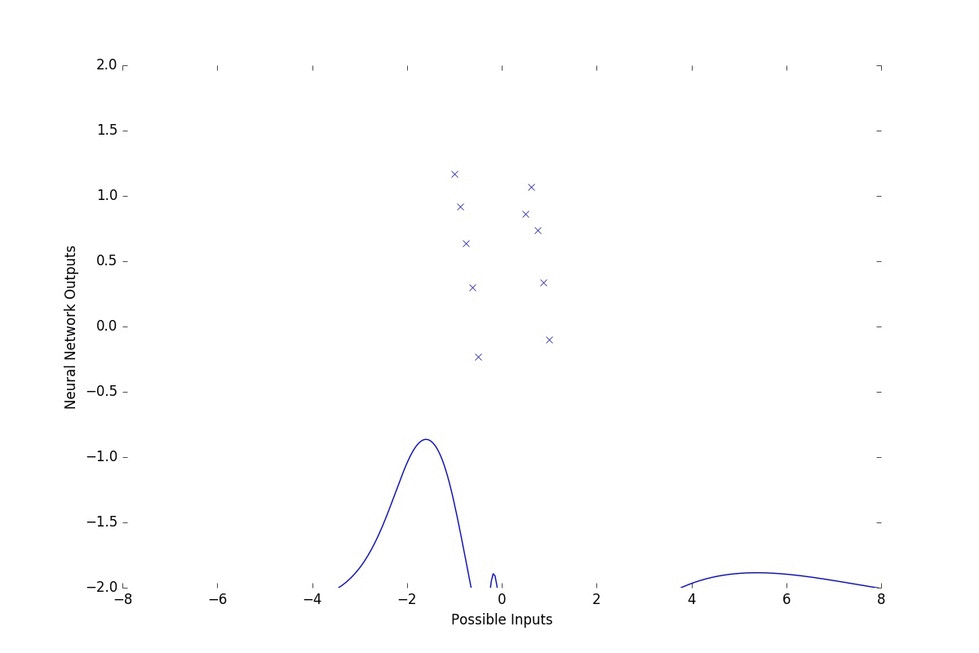
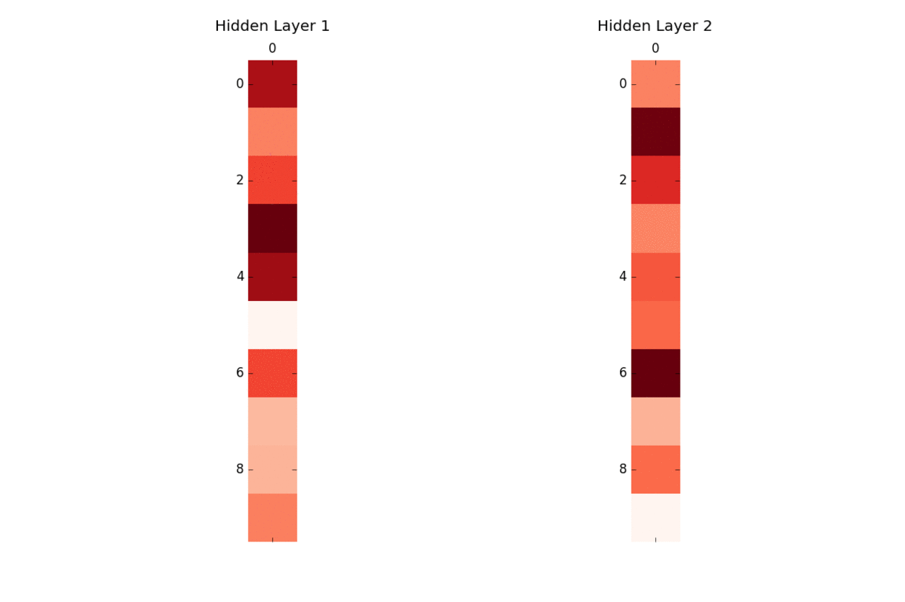

# Optimized and Generalized Neural Network Example

Now, we will generalize our notion of a neural network. In our previous tutorial, "Simple Neural Network For Binary Classification Example", we looked at a simple method of developing a neural network for binary classification and training it using backpropagation.

Here, we will make two changes:

	*	Generalize the neural network to not just a binary classifier, but a system capable of learning any nonlinear function
	
	*	Use a different form of learning than backpropagation

Lets step through the code.

### Step 1: Define parameters, inputs, and targets

```python

    # Model parameters
    layer_sizes = [1,10,10,1]
    L2_reg = 0.01

    # Training parameters
    param_scale = 1.0
    step_size = 0.1
    inputs, targets = build_toy_dataset()

    # Randomly initialize the neural net parameters
    init_params = init_random_params(param_scale, layer_sizes)
```

Our inputs and targets are specified by the build_toy_dataset() function shown below:

```python

def build_toy_dataset(n_data=20, noise_std=0.1):
    D = 1
    rs = npr.RandomState(0)
    inputs  = np.concatenate([np.linspace(0, 2, num=n_data/2),
                              np.linspace(6, 8, num=n_data/2)])
    targets = np.cos(inputs) + rs.randn(n_data) * noise_std
    inputs = (inputs - 4.0) / 4.0
    inputs  = inputs.reshape((len(inputs), D))
    targets = targets.reshape((len(targets), D))
    return inputs, targets

```

It just creates two numpy arrays as sample inputs and targets following a function that takes as inputs numbers within (-1,-0.5),(0.5,1), and returns its cosine with some added noise. The inputs and targets would look as such:

	Inputs 

	array([[-1.        ],				
       [-0.94444444],
       [-0.88888889],
       [-0.83333333],
       [-0.77777778],
       [-0.72222222],
       [-0.66666667],
       [-0.61111111],
       [-0.55555556],
       [-0.5       ],
       [ 0.5       ],
       [ 0.55555556],
       [ 0.61111111],
       [ 0.66666667],
       [ 0.72222222],
       [ 0.77777778],
       [ 0.83333333],
       [ 0.88888889],
       [ 0.94444444],
       [ 1.        ]])


   ---

   	Targets

   	array([[  1.17640523e+00],
       [  1.01542581e+00],
       [  1.00072347e+00],
       [  1.00997658e+00],
       [  8.17030850e-01],
       [  3.45938234e-01],
       [  3.30246415e-01],
       [  1.04460393e-04],
       [ -2.15828606e-01],
       [ -3.75086986e-01],
       [  9.74574644e-01],
       [  1.14356968e+00],
       [  1.06312967e+00],
       [  9.39535205e-01],
       [  8.66488047e-01],
       [  7.09772354e-01],
       [  6.46850548e-01],
       [  2.73500390e-01],
       [  1.07436895e-01],
       [ -2.30909608e-01]])

[Code](../final_code/neural_net_optimized.py)



