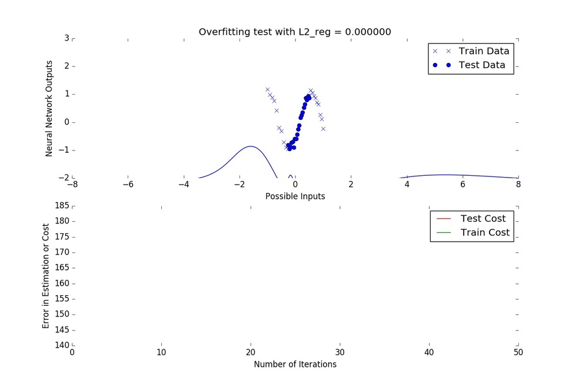
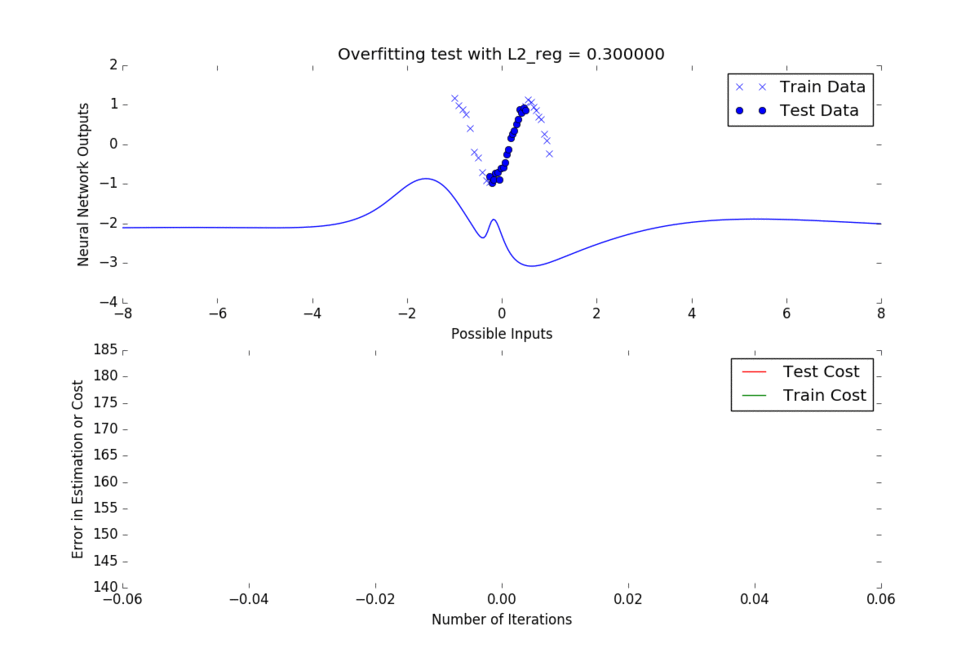

# Regularization Example

In this example, we will refer to our [Optimized and Generalized Neural Network Example](../final_code/neural_net_optimized.py), and will analyze the effect of regularization.

Regularization is a technique in Machine Learning used to prevent overfitting, or the forced fitting of data that is not reflective of real data. It can be more intuitively described as attempting to fit the training data perfectly, but this will likely not allow the function to generalize to other test cases.

We will use our previous example, where we optimize a neural network using autograd to fit points of the cos() function. We choose random points within the ranges (0,3) and (6,8), with some noise to them. See below.

```python
def build_train_dataset(n_data=20, noise_std=0.1):
    D = 1
    rs = npr.RandomState(0)
    inputs  = np.concatenate([np.linspace(0, 3, num=n_data/2),
                              np.linspace(6, 8, num=n_data/2)])
    targets = np.cos(inputs) + rs.randn(n_data) * noise_std
    inputs = (inputs - 4.0) / 4.0
    inputs  = inputs.reshape((len(inputs), D))
    targets = targets.reshape((len(targets), D))
    return inputs, targets
```

This will be our training set. Now, to see whether this generalizes well to other points of the cos() function, we will create a test set in order to test our predictions:

```python
def build_test_dataset(n_data=20, noise_std=0.1):
    D = 1
    rs = npr.RandomState(0)
    inputs  = np.concatenate([np.linspace(3, 6, num=n_data)])
    targets = np.cos(inputs) + rs.randn(n_data) * noise_std
    inputs = (inputs - 4.0) / 4.0
    inputs  = inputs.reshape((len(inputs), D))
    targets = targets.reshape((len(targets), D))
    return inputs, targets
```

The test points are within the range (3,6), and therefore will require our neural network to interpolate from the data it has been trained on. 

As we mentioned earlier, we are looking to maximize the probability of our network weights being correct, or equivalently, we minimize the negative log probability of our network weights being correct. 

A component of our log_likelihood term is the log_prior (the P(x)) term in our [previous example](../final_code/optimized_neural_network_example.md), and this is interpreted as the general probability of our weights. This is a little abstract, and it is believed that there are many ways of interpreting this. Here, we take it to refer to how realistic our weights are looking. Generally, if our weights are of very high values, we could take that to mean that the function tried to "forcedly" fit our training data. We can therefore penalize any action geared towards force fitting our function, and we can set the log_likelihood factor equal to the square sum of all the weights (we square each weight as an attempt to compare the magnitudes). This is what our l2_norm function does!

```python
def l2_norm(params):
    """Computes l2 norm of params by flattening them into a vector."""
    flattened, _ = flatten(params)
    return np.dot(flattened, flattened)
```
After this, our log_prior is multiplied by an experimental factor we call L2_reg and added to the log_likelihood. The L2_reg factor is what we are trying to pick when we talk about l2 regularization. If L2_reg is too large, then the function will never be inclined to increase its weights, and so the function will look closest to a constant function:


Here, we are plotting Inputs against Outputs in the first plot (same as in previous example), and Iterations against Error in the second plot.

The Error refers to the cost (the squared difference between the neural net predictions and the targets), and the number of iterations refers to the number of optimization steps that have been taken.

We can see in the top plot that the fitting function eventually looks close to flat, and on the bottom plot we can see that the Test Cost does not approach zero but hovers at a value above that of the Traning Cost, implying that this value for our L2_reg variable does not bring us to our desired state of having zero error on test cases.

How about we lower the L2_reg factor to 0, what happens? Well..



This is what we call overfitting. We can see that the Test cost does go down, but after around iteration 50 it jumps up again and hovers at a value above zero. Our function is only worrying about the training points (the X's in the top plot), and ignoring the test points (the dark blue dots in the top plot).

Maybe if we try something a little higher than 0, like 0.1 for our L2_reg. This produces:


We can see that in this case, the Test Cost is almost invisible near iteration 60, and this is because the function is not force fitting our training data, but is attempting to generalize itself to fit all realistic sorts of inputs. Let us try one more value, 0.3 for our L2_reg:



This is very similar to the 0.1 case, where the error really tapers out very close to zero. However, by visual examination of the function fitting occuring at the top, it seems that 0.1 might be the best choice for our L2_reg.

And that is all for regularization. It is important to keep our models general, and new data should not come as a surprise. Code for this graphical implementation can be found [here](../final_code/regularization.py).
